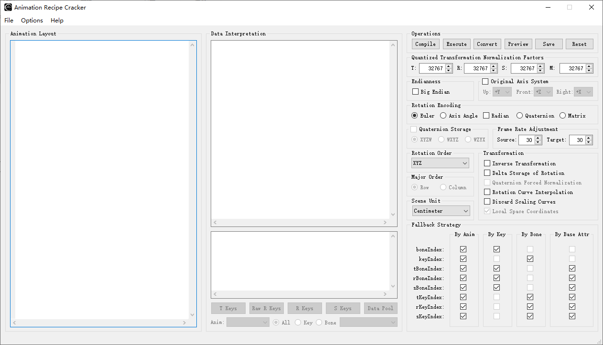
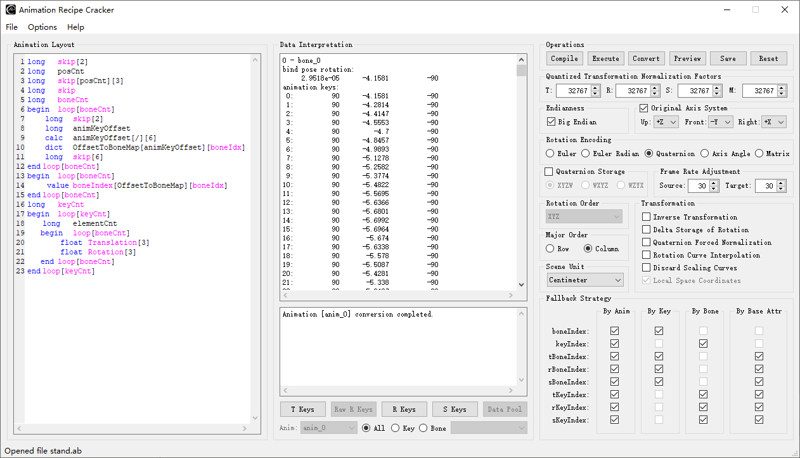
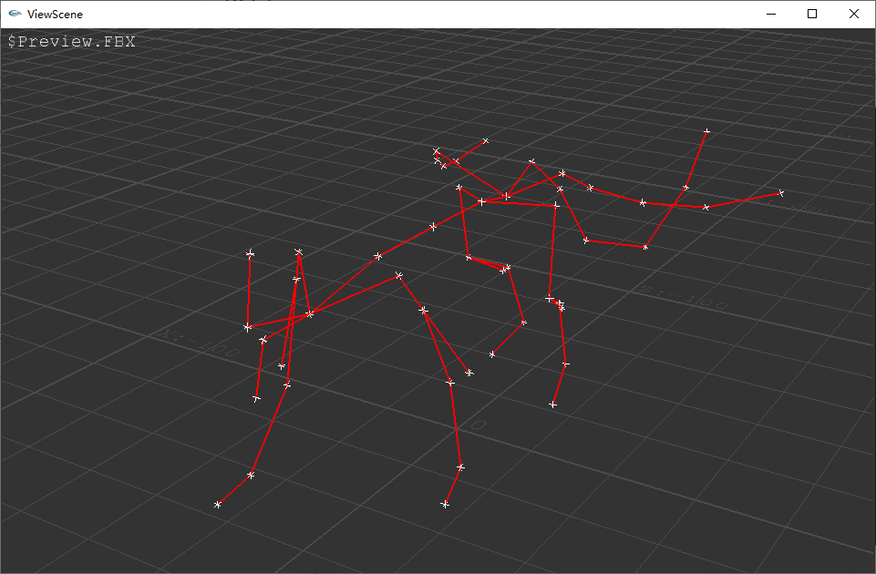
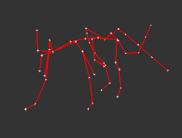

# User Manual of the Animation Recipe Cracker

Animation Recipe Cracker, abbreviated as ARC, is a helper tool aimed for quick research and examination on animation data. It provides a text-based C-like layout definition interface with dozens of pre-defined variables, along with other commands for custom variable definition, allowing to de-serialize different animation formats in a concise yet flexible way. There're also plenty of useful GUI options for interpreting the read data.



## Syntax of the Layout Definition Interface

Each variable definition statement follows a simple syntax shown below:
`Type	Variable[Size][Size] // comment here.`
where `Type` stands for the allowed general data type or command for `Variable`, and `Size` in the square brackets is an optional field that specifies the 1st and the 2nd dimension sizes if the variable is an array, or the operators and/or the operands if `Type` is a command. Only certain pre-defined variables support both 2 dimensions to be defined, while the rest of them allow only 1 or 0 dimension. Single line comment is allowed using the `//` identifier.

There's no limit for the number of white spaces (space or tab) placed between `Type` and `Variable`, and that after the last dimension size.

## Variable Types

Each general type is defined by a type group consists of a set of specific basic types. Some of the basic types have the same semantics as their corresponding C-types, while the rest of them act as functions and commands in a manner similar to the C-struct member declaration.

### General Type Groups

| Type Group | Instantiated Types | Description |
| - | - | - |
| **Integer** | char, byte, short, word, <br/>int24, uint24, long, uint32 | integer types |
| **Real** | half, short, float, double | floating point types, where `short` is normalized by a specific factor |
| **TChar** | char, byte, word | string compatible types |
| **Eval** | calc, test, assert | calculation, judgement and assertion |
| **Math** | sqrt | calculate the square root of the operand |
| **Func** | size | calculate the size of a container variable |
| **Loop** | break | break the current loop |
| **State** | begin, end | declare the scope of a struct/command group/loop |
| **Access** | refer, value | access to elements in a container variable by reference or by value |
| **Vector** | push | append element into a vector variable |
| **Dict** | dict | insert element into a dictionary variable |
| **Clear** | clear | delete a variable and its content |
| **Seek** | seek, align | jump to an absolute address in file;<br/>align current address by specified amount of bytes |
| **Tell** | tell | get the current address in file |
| **Using** | using | reference to a defined named layout |
| **Typedef** | typedef | define an alias for a basic type |

### Eval Operators

| Operation Types | Instantiated Operators | Description |
| - | - | - |
| calc | +, -, *, /, %, &, \|, ^, <<, >>, = | arithmetic and bit operations |
| test | ==, !=, >, <, >=, <= | logical operations |
| assert | ==, !=, >, <, >=, <= | assertion, stop execution if evaluated result is false |

## Variables

### Predefined Fundamental Variables

| Variables | Description |
| - | - |
| **`skip`** | for data skipping/relative forward seeking |
| **`length`** | used in combination with **`skip`** and **`Eval `** operations for variant-length data structure manipulations |
| **`string`** | general string variable, allows literal, dynamic length size using the '`?`'  mark, or use **`length`** |
| **`scope`** | body wrapper of a set of statements execute depend on a condition |
| **`loop`** | body wrapper of a set of statements execute by a loop |
| **`address`** | for address seeking & telling |

### Predefined Animation-Related Variables

| Variables | Description |
| - | - |
|**`animCnt`** | count of animations. when used in loop, its iteration index is bound to `animIdx` |
|**`animName`** | name of the animation |
|**`boneCnt`** | count of animated bones. when used in loop, its iteration index is bound to `boneIdx` |
|**`keyCnt`** | count of animation keys. when used in loop, its iteration index is bound to `keyIdx` |
|**`tBoneIndex`** | bone index referenced by **`Translation`**, can fall back to shared **`boneIndex`** |
|**`rBoneIndex`** | bone index referenced by **`Rotation`**, can fall back to shared **`boneIndex`** |
|**`sBoneIndex`** | bone index referenced by **`Scaling`**, can fall back to shared **`boneIndex`** |
|**`boneIndex`** | bone index referenced by **`Translation`**/**`Rotation`**/**`Scaling`**/**`TransformMatrix`** |
|**`tKeyIndex`** | key index referenced by **`Translation`**, can fall back to shared **`keyIndex`** |
|**`rKeyIndex`** | key index referenced by **`Rotation`**, can fall back to shared **`keyIndex`** |
|**`sKeyIndex`** | key index referenced by **`Scaling`**, can fall back to shared **`keyIndex`** |
|**`keyIndex`** | key index referenced by **`Translation`**/**`Rotation`**/**`Scaling`**/**`TransformMatrix`** |
|**`boneName`** | name of the animated bone. used when no bone index is present in data |
|**`Translation`** | translation factor of the animation key |
|**`Rotation`** | rotation factor of the animation key |
|**`Scaling`** | scaling factor of the animation key |
|**`TransformMatrix`** | combined transformation matrix of T/R/S. with higher priority than individual T/R/S components |
|**`animIdx`** | read-only integer. implicit loop-bind variable that can be referenced as operand |
|**`boneIdx`** | read-only integer. implicit loop-bind variable that can be referenced as operand |
|**`keyIdx`** | read-only integer. implicit loop-bind variable that can be referenced as operand |

### Custom Variables

Other than the pre-defined variables user can define any custom variables for complex data manipulation. It's also possible to defined a named layout and reference it somewhere with a simple `using` statement.

## Variable Constraints

Each pre-defined/custom variable has its own specific constraints, which define the allowed types and corresponding size candidates. Literal number/string can also be used as sizes or operands. The notations of some size fields used by the constraints are described below:
| Notation | Description |
| - | - |
| `num` | hex integer literal prefixed by `0x`, e.g. 0x789C or 0x789c; <br/>decimal signed/unsigned integer,  e.g. -2 or 2;<br/>floating-point signed/unsigned number, e.g.  3.1415926, -0.707 |
| `str` | string literal enclosed by `''` or `""`, e.g. `'root'` or `"root"` |
| `ivar` | custom integer variable |
| `fvar` | custom floating-point variable |
| `svar` | custom string variable |
| `cvar` | custom container variable, i.e. dict, vector, array or string |
| `var` | custom variable of types including `ivar`,`fvar`, `svar` and `cvar` |
| **`?`** | notation for null-terminated string with unpredictable length |
| `op` | notation for operators |

Various size candidates will be separated by the `|` mark.

### Predefined Fundamental Variables

| Variables | Constraints |
| :-- | - |
| **`skip`** | `Integer`    `skip`<br/>`Integer`    `skip`[`num`\|**`length`**\|`ivar`]<br/>`Integer`    `skip`[`num`\|**`length`**\|`ivar`]\[`num`]<br/>`Integer`    `skip`[`num`]\[`num`\|**`length`**\|`ivar`]<br/>`Integer`    `skip`[`ivar`]\[`ivar`] |
| **`length`** | `Integer`    `length`<br/>`Eval`           `length`[`op`]\[`num`\|`ivar`]<br/>`Func`           `length`[`ivar`] |
| **`string`** | `TChar`         `string`[`num`\|**`?`**\|**`length`**] |
| **`scope`** | `State`         `scope` |
| **`loop`** | `State`         `loop`[`num`\|**`length`**\|`ivar`]<br/>`Loop`         `loop`[`num`\|**`length`**\|`ivar`] |
| **`address`** | `Seek`           `address`[`num`\|**`length`**\|`ivar`]<br/>`Tell`           `address`[**`length`**\|`ivar`] |

### Predefined App-Specific Variables

| Variables | Constraints |
| - | - |
|**`animCnt`** | `Integer`    `animCnt`<br/>`Eval`           `animCnt`[`op`]\[`num`\|`ivar`]<br/>`Access`      `animCnt`[`cvar`]\[`num`\|`ivar`\|`svar`]<br/>`Func`           `animCnt`[`ivar`] |
|**`animName`** | `TChar`         `animName`[`num`\|**`?`**\|**`length`**]<br/>`TChar`         `animName`[**`animCnt`**]\[`num`\|**`?`**\|**`length`**] |
|**`boneCnt`** | `Integer`    `boneCnt`<br/>`Eval`           `boneCnt`[`op`]\[`num`\|`ivar`]<br/>`Access`      `boneCnt`[`cvar`]\[`num`\|`ivar`\|`svar`]<br/>`Func`           `boneCnt`[`ivar`] |
|**`keyCnt`** | `Integer`    `keyCnt`<br/>`Eval`           `keyCnt`[`op`]\[`num`\|`ivar`]<br/>`Access`      `keyCnt`[`cvar`]\[`num`\|`ivar`\|`svar`]<br/>`Func`           `keyCnt`[`ivar`] |
|**`tBoneIndex`** | `Integer`    `tBoneIndex`<br/>`Integer`    `tBoneIndex`[**`boneCnt`**]<br/>`Eval`           `tBoneIndex`[`op`]\[`num`\|`ivar`]<br/>`Access`      `tBoneIndex`[`cvar`]\[`num`\|`ivar`\|`svar`] |
|**`rBoneIndex`** | `Integer`    `rBoneIndex`<br/>`Integer`    `rBoneIndex`[**`boneCnt`**]<br/>`Eval`           `rBoneIndex`[`op`]\[`num`\|`ivar`]<br/>`Access`      `rBoneIndex`[`cvar`]\[`num`\|`ivar`\|`svar`] |
|**`sBoneIndex`** | `Integer`    `sBoneIndex`<br/>`Integer`    `sBoneIndex`[**`boneCnt`**]<br/>`Eval`           `sBoneIndex`[`op`]\[`num`\|`ivar`]<br/>`Access`      `sBoneIndex`[`cvar`]\[`num`\|`ivar`\|`svar`] |
|**`boneIndex`** | `Integer`    `boneIndex`<br/>`Integer`    `boneIndex`[**`boneCnt`**]<br/>`Eval`           `boneIndex`[`op`]\[`num`\|`ivar`]<br/>`Access`      `boneIndex`[`cvar`]\[`num`\|`ivar`\|`svar`] |
|**`tKeyIndex`** | `Integer`    `tKeyIndex`<br/>`Integer`    `tKeyIndex`[**`keyCnt`**]<br/>`Eval`           `tKeyIndex`[`op`]\[`num`\|`ivar`]<br/>`Access`      `tKeyIndex`[`cvar`]\[`num`\|`ivar`\|`svar`] |
|**`rKeyIndex`** | `Integer`    `rKeyIndex`<br/>`Integer`    `rKeyIndex`[**`keyCnt`**]<br/>`Eval`           `rKeyIndex`[`op`]\[`num`\|`ivar`]<br/>`Access`      `rKeyIndex`[`cvar`]\[`num`\|`ivar`\|`svar`] |
|**`sKeyIndex`** | `Integer`    `sKeyIndex`<br/>`Integer`    `sKeyIndex`[**`keyCnt`**]<br/>`Eval`           `sKeyIndex`[`op`]\[`num`\|`ivar`]<br/>`Access`      `sKeyIndex`[`cvar`]\[`num`\|`ivar`\|`svar`] |
|**`keyIndex`** | `Integer`    `keyIndex`<br/>`Integer`    `keyIndex`[**`keyCnt`**]<br/>`Eval`           `keyIndex`[`op`]\[`num`\|`ivar`]<br/>`Access`      `keyIndex`[`cvar`]\[`num`\|`ivar`\|`svar`] |
|**`boneName`** | `TChar`         `boneName`[`num`\|**`?`**\|**`length`**]<br/>`TChar`         `boneName`[**`boneCnt`**]\[`num`\|**`?`**\|**`length`**] |
|**`Translation`** | `Real`           `Translation`[`3`\|`4`]<br/>`Real`           `Translation`[**`keyCnt`**]\[`3`\|`4`]<br/>`Access`      `Translation`[`cvar`]\[`num`\|`ivar`\|`svar`] |
|**`Rotation`** | `Real`           `Rotation`[`3`\|`4`\|`9`]<br/>`Real`           `Rotation`[**`keyCnt`**]\[`3`\|`4`\|`9`]<br/>`Access`      `Rotation`[`cvar`]\[`num`\|`ivar`\|`svar`] |
|**`Scaling`** | `Real`           `Scaling`<br/>`Real`           `Scaling`[`3`\|`4`\|**`keyCnt`**]<br/>`Real`           `Scaling`[**`keyCnt`**]\[`3`\|`4`]<br/>`Access`      `Scaling`[`cvar`]\[`num`\|`ivar`\|`svar`] |
|**`TransformMatrix`** | `Real`           `TransformMatrix`[`12`\|`1`6]<br/>`Real`           `TransformMatrix`[**`keyCnt`**]\[`12`\|`16`]<br/>`Access`      `TransformMatrix`[`cvar`]\[`num`\|`ivar`\|`svar`] |

### Custom Variables

| Variables | Constraints |
| - | - |
|**`Variable`** | `Integer`     `Variable`<br/>`Integer`     `Variable`[`num`\|**`length`**\|`ivar`]<br/>`Integer`     `Variable`[`num`\|**`length`**\|`ivar`]\[`num`\|**`length`**\|`ivar`]<br/>`Real`           `Variable`<br/>`Real`           `Variable`[`num`\|**`length`**\|`ivar`]<br/>`Real`           `Variable`[`num`\|**`length`**\|`ivar`]\[`num`\|**`length`**\|`ivar`]<br/>`Eval`           `Variable`[`op`]\[`num`\|**`length`**\|`ivar`\|`svar`]<br/>`Math`           `Variable`[`num`\|**`length`**\|`ivar`]<br/>`Func`           `Variable`[`ivar`]<br/>`Access`      `Variable`[`cvar`]\[`num`\|`ivar`\|`svar`]<br/>`Vector`      `Variable`[`num`\|`str`\|**`length`**\|`var`]<br/>`Dict`           `Variable`[`num`\|`str`]\[`num`\|`str`]<br/>`Dict`           `Variable`[`ivar`\|`svar`]\[`num`\|`str`\|**`length`**\|`var`]<br/>`Clear`         `Variable`<br/>`State`         `Variable`<br/>`Using`         `Variable`<br/>`Typedef`     `Variable`[`char`\|`byte`\|`short`\|`word`\|`int24`\|`uint24`\|`long`\|`uint32`\|`half`\|`float`\|`double`] |

### Semantic Usage Examples

#### Conditional Scope

```
long cnt
test cnt[==][0]
begin scope
	calc	cnt[+][1]
	calc	cnt[+][2]
end scope
```

#### Loop

```
long	cnt
begin loop[cnt]
	long value
	test value[<][0]
	break loop[cnt]
end loop[cnt]
```

#### Named Layout

```
begin namedLayout
	long len
	calc len[*][-1]
end namedLayout

using namedLayout
char string[len]
```

#### Dynamic Type

```
typedef	dynamicType[float]
long flag
test flag[==][0]
typedef dynamicType[half]
dynamicType Translation[3]
```

#### **Vector Container**

```
long element
push Container[element]
value ele0[Container][0]
refer ele0Ref[Container][0]
```

#### **Dictionary Container**

```
long key
long Value
dict dictContainer[key][Value]
value itemValue[dictContainer][key]
refer itemValueRef[dictContainer][key]
```

## Data Interpretation Options

| Options                          | Description                                                  |
| -------------------------------- | ------------------------------------------------------------ |
| Endianness                       | byte order of how data are read                              |
| Rotation Encoding                | representation form of rotation                              |
| Quaternion Storage               | storage order of quaternion components                       |
| Rotation Order                   | order of rotations along X, Y and Z axis                     |
| Major Order                      | major order of rotation or transformation matrix             |
| Scene Unit                       | unit of FBX scene                                            |
| Inverse Transformation           | inverse of transformation regardless of the representation form it uses |
| Delta Storage of Rotation        | each rotation key is additive to its previous key            |
| Quaternion Forced Normalization  | force normalization on quaternion keys                       |
| Rotation Curve Interpolation     | enable key interpolation for rotations                       |
| Discard Scaling Curves           | discard animation curves for scaling                         |
| Local Space Coordinate           | coordinate space of the transformation, not used at the moment. <br/>so all transformations are expected to be in parent space |
| Source Frame Rate                | source frame rate. default is 30 fps                         |
| Target Frame Rate                | desired frame rate. default is 30 fps. must be larger than the source one |
| Translation Normalizer           | normalize factor for Translation encoding as short           |
| Rotation Normalizer              | normalize factor for Rotation encoding as short              |
| Scaling Normalizer               | normalize factor for Scaling encoding as short               |
| Transformation Matrix Normalizer | normalize factor for Transformation Matrix encoding as short |
| Original Axis System             | original axis system of the animation keys                   |

## Data Fallback Strategy

The fallback strategy affects the behavior when data of a property does not exist at the target slot. If the fallback flag is set, the app will try to use the data at slot 0 when it's not present at the target slot. The derived property can also fallback to its base attribute if the data at slot 0 is not found either. Note that **boneName** follows the same fallback strategy as **boneIndex** when the latter is not present. 

Do NOT mess with these settings unless you know what you're doing.

| Options                         | Description                                                  |
| ------------------------------- | ------------------------------------------------------------ |
| boneIndex                       | fall back to value at animation 0 or key 0 if corresponding slot does not exist |
| keyIndex                        | fall back to value at animation 0 or bone 0 if corresponding slot does not exist |
| tBoneIndex                      | fall back to value at animation 0 or key 0 if corresponding slot does not exist. <br/>fall back to boneIndex if tBoneIndex not present |
| rBoneIndex                      | fall back to value at animation 0 or key 0 if corresponding slot does not exist. <br/>fall back to boneIndex if rBoneIndex not present |
| sBoneIndex                      | fall back to value at animation 0 or key 0 if corresponding slot does not exist. <br/>fall back to boneIndex if sBoneIndex not present |
| tKeyIndex                       | fall back to value at animation 0 or bone 0 if corresponding slot does not exist. <br/>fall back to keyIndex if tKeyIndex not present |
| rKeyIndex                       | fall back to value at animation 0 or bone 0 if corresponding slot does not exist. <br/>fall back to keyIndex if rKeyIndex not present |
| sKeyIndex                       | fall back to value at animation 0 or bone 0 if corresponding slot does not exist. <br/>fall back to keyIndex if sKeyIndex not present |

## Data Storage

All variables are stored in a global level. The pre-defined animation data related variables are stored each in a nested scheme listed in the following table. Any other variables are stored in a straightforward manner.

| Storage Scheme                                               | Variables                                                    | Note                                                         |
| ------------------------------------------------------------ | ------------------------------------------------------------ | ------------------------------------------------------------ |
| for each animation<br/>&ensp;&ensp;&ensp;data                | **`animName`**                                               |                                                              |
| for each animation<br/>&ensp; &ensp;&ensp;for each key<br/>&ensp;&ensp;&ensp;&ensp;&ensp;&ensp;&ensp;for each bone<br/>&ensp;&ensp;&ensp;&ensp;&ensp;&ensp;&ensp;&ensp;&ensp;&ensp;data | **`tBoneIndex`**<br/>**`rBoneIndex`**<br/>**`sBoneIndex`**<br/>**`boneIndex`**<br/>**`tKeyIndex`**<br/>**`rKeyIndex`**<br/>**`sKeyIndex`**<br/>**`keyIndex`**<br/>**`boneName`**<br/>**`Translation`**<br/>**`Rotation`**<br/>**`Scaling`**<br/>**`TransformMatrix`** | data of all these attributes<br/>match with each other at<br/>the same slots |

## Supported Animation Data Structure

Currently the following data structures are supported:

Hierarchy:

```c
for each anim
	for	each bone
		for each frame
```

Cases:

``````c
// combined key
for each anim
	for	each bone
		boneName/boneIndex
		for each frame
			keyTime
			keyData

// individual key components
for each anim
	for	each bone
		boneName/boneIndex
		for each frame
			keyTime
			tKeyData
			rKeyData
			sKeyData

// individual key components and corresponding time curves
for each anim
	for	each bone
		boneName/boneIndex
		for each tFrame
			tKeyTime
			tKeyData
		for each rFrame
			rKeyTime
			rKeyData
		for each sFrame
			sKeyTime
			sKeyData
``````

Hierarchy:

```c
for	each bone
	for each anim
		for each frame
```

Cases:

``````c
// combined key
for	each bone
	boneName/boneIndex
	for each anim
		for each frame
			keyTime
			keyData

// individual key components
for	each bone
	boneName/boneIndex
	for each anim
		for each frame
			keyTime
			tKeyData
			rKeyData
			sKeyData

// individual key components and corresponding time curves
for	each bone
	boneName/boneIndex
	for each anim
		for each tFrame
			tKeyTime
			tKeyData
		for each rFrame
			rKeyTime
			rKeyData
		for each sFrame
			sKeyTime
			sKeyData
``````

Hierarchy:

```c
for each anim
	for each frame
		for each bone
```

Cases:

``````c
// combined key
for each anim
	for each frame
		keyTime
		for each bone
			boneName/boneIndex
			keyData

// individual key components
for	each anim
	for each frame
		keyTime
		for each bone
			boneName/boneIndex
			tKeyData
			rKeyData
			sKeyData

// individual key components and corresponding time curves
for	each anim
	for each tFrame
		tKeyTime
		for each bone
			tBoneIndex
			tKeyData
	for each rFrame
		rKeyTime
		for each bone
			rBoneIndex
			rKeyData
	for each sFrame
		sKeyTime
		for each bone
			sBoneIndex
			sKeyData
``````

## Animation Conversion Routine

ARC doesn't deal with skeleton data itself. You must use ASH to parse the skeleton correctly and generate an exchange node dump for use in ARC. The skeleton is expected to be converted to the target axis system already before imported into ARC. 

## Example

### Stand

```
long	skip[2]
long	posCnt
long	skip[posCnt][3]
long	skip
long	boneCnt
begin	loop[boneCnt]
	long	skip[2]
	long	animKeyOffset
	calc	animKeyOffset[/][6]
	dict	OffsetToBoneMap[animKeyOffset][boneIdx]
	long	skip[6]
end	loop[boneCnt]
begin	loop[boneCnt]
	value	boneIndex[OffsetToBoneMap][boneIdx]
end	loop[boneCnt]
long	keyCnt
begin	loop[keyCnt]
	long	elementCnt
	begin	loop[boneCnt]
		float	Translation[3]
		float	Rotation[3]
	end	loop[boneCnt]
end	loop[keyCnt]
```

```
BigEndian, Quaternion, ColMajor, Up/Front/Right: +Z/-Y/X
```






