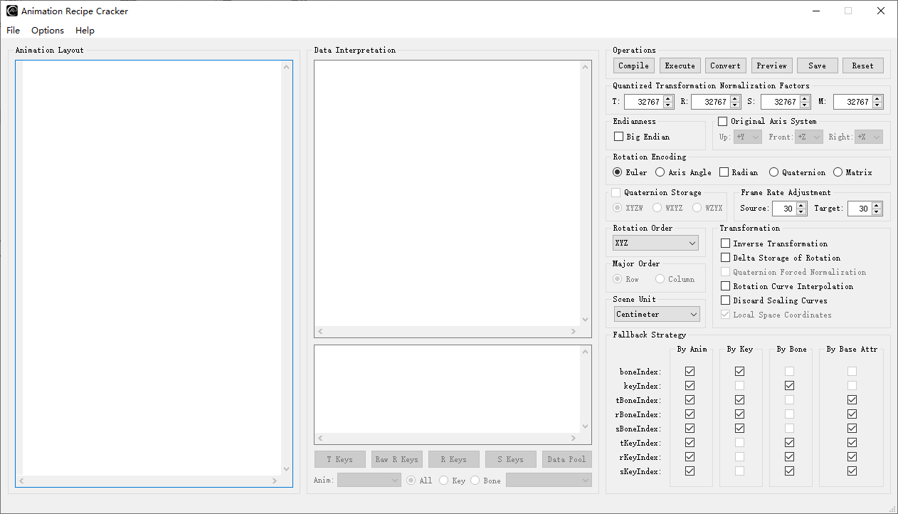

# Introduction
Animation Recipe Cracker, abbreviated as ARC, is a helper tool aimed for quick research and examination on animation data. It provides a text-based C-like layout definition interface with dozens of pre-defined variables, along with other commands for custom variable definition, allowing to de-serialize different animation formats in a concise yet flexible way. There're also plenty of useful GUI options for interpreting the read data. 

# Main Features
- Support for parsing animation related data of all sorts of data types;
- Ability to handle variant-length data structures;
- Support for common arithmetic, logical and bit operations;
- Support for conditional evaluations and loop statements;
- Support for dictionary/vector assignment and reference;
- Formatting operations for debugging raw/converted transformation info and entire data pool;
- Visualization of animation;
- Export of the animation as the FBX format.

# System Requirement
Windows XP, Windows 7, Windows 8 or Windows 10 with Visual C++ 2015 redistributable or
newer versions installed.
